<picture>
  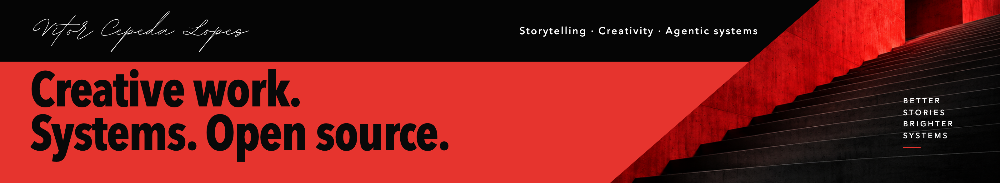
</picture>

My path began in music and technical theatre and grew into film, advertising and visual storytelling. Along the way, I've kept finding ways to adapt technology and build better systems for creative work.

I founded TheHive to make ambitious storytelling more accessible without compromising creative quality. Today, I'm exploring what a company can become in a world with agents, building generative production workflows and agentic systems, and contributing to open source.

Working with agents lets me bring ideas to life that I previously lacked the means to build. I look for ways that solving our own needs can help the wider community too. Storytelling remains the thread connecting all of it.

[Portfolio](https://www.vitorcepedalopes.com/portfolio) · [LinkedIn](https://www.linkedin.com/in/theangrypit/) · [Writing](https://www.linkedin.com/newsletters/%F0%9F%A7%A0-themind-shift-by-vcl-7373346533582286848/) · [X](https://x.com/TheAngryPit)

### Tools

<a href="https://github.com/openai/codex">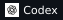</a>
<a href="https://openclaw.ai">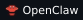</a>
<a href="https://github.com/NousResearch/hermes-agent">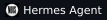</a>
<a href="https://github.com/PrimeIntellect-ai/prime-agent">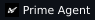</a>
<a href="https://github.com/OpenWhispr/openwhispr">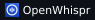</a>

<a href="https://ghostty.org">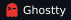</a>
<a href="https://github.com/ggml-org/llama.cpp">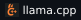</a>
<a href="https://github.com/vectorize-io/hindsight">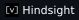</a>
<a href="https://github.com/plastic-labs/honcho">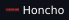</a>

<a href="https://e2b.dev">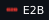</a>
<a href="https://github.com/Comfy-Org/ComfyUI">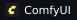</a>

### Languages

<a href="https://www.swift.org">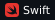</a>

<a href="https://www.sqlite.org/lang.html">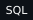</a>
<a href="https://developer.mozilla.org/en-US/docs/Web/JavaScript">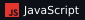</a>

### Operating systems

### Programs & support

<a href="https://openai.com/daybreak/">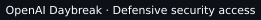</a>

## GitHub activity

<picture>
  <source media="(max-width: 600px) and (prefers-color-scheme: dark)" srcset="assets/activity-isometric-mobile-dark-six-months.svg">
  <source media="(max-width: 600px) and (prefers-color-scheme: light)" srcset="assets/activity-isometric-mobile-light-six-months.svg">
  <source media="(prefers-color-scheme: dark)" srcset="assets/activity-isometric-dark-six-months.svg">
  <source media="(prefers-color-scheme: light)" srcset="assets/activity-isometric-light-six-months.svg">
  
</picture>

<picture>
  <source media="(max-width: 600px) and (prefers-color-scheme: dark)" srcset="assets/metrics-mobile-dark-six-months.svg">
  <source media="(max-width: 600px) and (prefers-color-scheme: light)" srcset="assets/metrics-mobile-light-six-months.svg">
  <source media="(prefers-color-scheme: dark)" srcset="assets/metrics-dark-six-months.svg">
  <source media="(prefers-color-scheme: light)" srcset="assets/metrics-light-six-months.svg">
  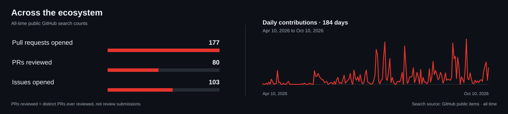
</picture>

### Data notes

<!-- PROFILE-DATA:START -->
- **Calendar — last six months:** 2,015 publicly displayed contributions · 10 April 2026–10 October 2026 (184 days).
- **Public search counts (all-time):** 177 public pull requests opened · 80 distinct public PRs ever reviewed · 103 public issues opened; retrieved 10 October 2026 UTC.
- The calendar shows a rolling six-month window from GitHub’s displayed activity, which may include privacy-obscured contributions; it is not a public-only total. Search counts use a different period.
<!-- PROFILE-DATA:END -->

## Building

- **[mailcrawl](https://github.com/TheAngryPit/mailcrawl)**: local-first, read-only archive for exported mail, designed around a searchable SQLite index; pre-alpha scaffold.
- **[meetcrawl](https://github.com/TheAngryPit/meetcrawl)**: local-first meeting transcript archive with SQLite search, privacy classes, provenance and read-only MCP for agents; Phase 1 code in-tree.
- **[TheAngrySkills](https://github.com/TheAngryPit/TheAngrySkills)**: creator and maintainer.
- **Nexus**: agent orchestration, governance and harness infrastructure; in development.
- **Almanac**: an OpenClaw-based OS; in development.
- **TheHiveOS**: a shared people, projects and client environment for generative-AI production management; in development and partly internal.

## Open-source contributions

Contributions to **OpenClaw**, **Hermes Agent**, **Hindsight**, **MLX Audio** and **Open Design**. These are upstream projects I contribute to, not projects I claim to own.

Data and sources

City rendering uses [GitHub Profile 3D Contrib](https://github.com/yoshi389111/github-profile-3d-contrib), customized to this profile's palette with a public-calendar adapter. Tools and language badges are generated by [Shields.io](https://shields.io); they do not indicate proficiency levels or certifications.

<!-- PROFILE-SOURCES:START -->
- **Contribution calendar:** [public GitHub contribution calendar](https://github.com/users/TheAngryPit/contributions); retrieved 10 October 2026 UTC. The full annual source is validated and retained; the charts display its last six calendar months, with totals recalculated for that period. The source may include privacy-obscured contributions. This package did not access private repositories.

- **public pull requests opened:** [Pull requests opened search](https://api.github.com/search/issues?q=is%3Apr+author%3ATheAngryPit+is%3Apublic&per_page=1); retrieved 10 October 2026 UTC.

- **distinct public PRs ever reviewed:** [PRs matched by the public reviewed-by search](https://api.github.com/search/issues?q=is%3Apr+reviewed-by%3ATheAngryPit+is%3Apublic&per_page=1); retrieved 10 October 2026 UTC.

- **public issues opened:** [Issues opened search](https://api.github.com/search/issues?q=is%3Aissue+author%3ATheAngryPit+is%3Apublic&per_page=1); retrieved 10 October 2026 UTC.

- The reviewed count is distinct pull requests ever reviewed, not the number of review submissions.

- Counts come from GitHub’s public Search API queries and are all-time snapshots; they do not share the calendar’s rolling date window.
<!-- PROFILE-SOURCES:END -->

