<picture>
  
</picture>

I build stories, systems and practical solutions.

[Portfolio](https://www.vitorcepedalopes.com/portfolio) · [LinkedIn](https://www.linkedin.com/in/theangrypit/) · [Writing](https://www.linkedin.com/newsletters/%F0%9F%A7%A0-themind-shift-by-vcl-7373346533582286848/)

### Tools

<a href="https://github.com/openai/codex">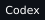</a>
<a href="https://openclaw.ai">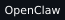</a>
<a href="https://github.com/NousResearch/hermes-agent">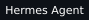</a>
<a href="https://github.com/PrimeIntellect-ai/prime-agent">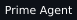</a>
<a href="https://github.com/OpenWhispr/openwhispr">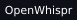</a>

<a href="https://ghostty.org">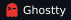</a>
<a href="https://github.com/ggml-org/llama.cpp">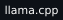</a>
<a href="https://github.com/vectorize-io/hindsight">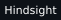</a>
<a href="https://github.com/plastic-labs/honcho">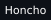</a>

<a href="https://e2b.dev">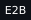</a>
<a href="https://github.com/Comfy-Org/ComfyUI">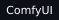</a>

### Languages

<a href="https://www.typescriptlang.org">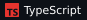</a>

<a href="https://www.python.org">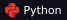</a>

### Operating systems

<a href="https://www.microsoft.com/windows">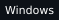</a>
<a href="https://ubuntu.com">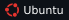</a>
<a href="https://omarchy.org">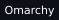</a>

### Programs & support

<a href="https://openai.com/daybreak/">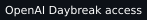</a>
<a href="https://developer.apple.com/programs/">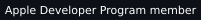</a>
<a href="https://developer.nvidia.com/developer-program">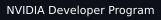</a>

Daybreak access for defensive security work.

## GitHub activity

<picture>
  <source media="(max-width: 600px) and (prefers-color-scheme: dark)" srcset="assets/activity-mobile-dark.svg">
  <source media="(max-width: 600px) and (prefers-color-scheme: light)" srcset="assets/activity-mobile-light.svg">
  <source media="(prefers-color-scheme: dark)" srcset="assets/activity-dark.svg">
  <source media="(prefers-color-scheme: light)" srcset="assets/activity-light.svg">
  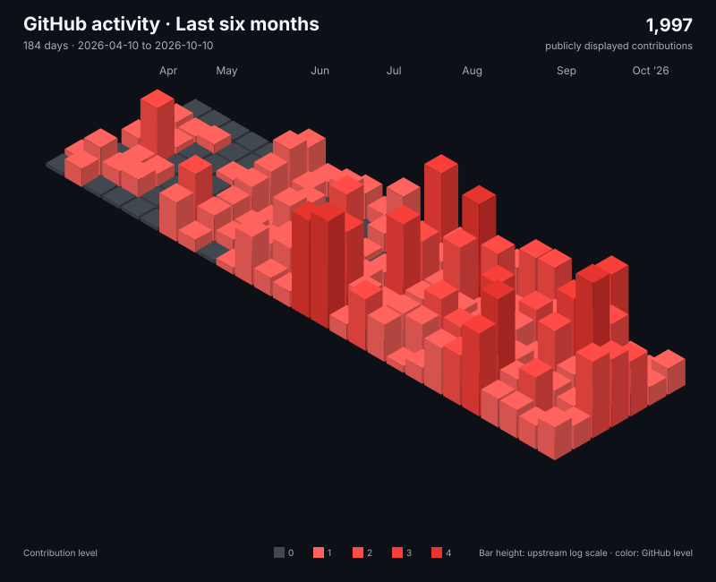
</picture>

<picture>
  <source media="(max-width: 600px) and (prefers-color-scheme: dark)" srcset="assets/metrics-mobile-dark.svg">
  <source media="(max-width: 600px) and (prefers-color-scheme: light)" srcset="assets/metrics-mobile-light.svg">
  <source media="(prefers-color-scheme: dark)" srcset="assets/metrics-dark.svg">
  <source media="(prefers-color-scheme: light)" srcset="assets/metrics-light.svg">
  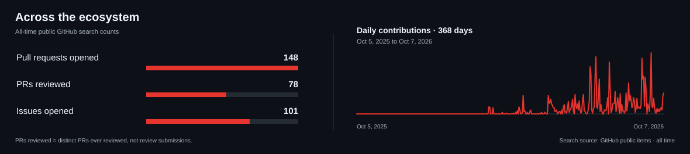
</picture>

### Data notes

<!-- PROFILE-DATA:START -->
- **Calendar:** 1,968 publicly displayed contributions · 5 October 2025–7 October 2026 (368 days).
- **Public search counts (all-time):** 148 public pull requests opened · 78 distinct public PRs ever reviewed · 101 public issues opened; retrieved 7 October 2026 UTC.
- GitHub’s displayed calendar is a rolling window that may include privacy-obscured activity; it is not a public-only total. Search counts use a different period.
<!-- PROFILE-DATA:END -->

## Building

- **[TheAngrySkills](https://github.com/TheAngryPit/TheAngrySkills)**: creator and maintainer.
- **Nexus**: agent orchestration, governance and harness infrastructure; in development.
- **Almanac**: an OpenClaw-based OS; in development.
- **TheHiveOS**: a shared people, projects and client environment for generative-AI production management; in development and partly internal.

## Open-source contributions

Contributions to **OpenClaw**, **Hermes Agent**, **Hindsight**, **MLX Audio** and **Open Design**. These are upstream projects I contribute to, not projects I claim to own.

Data and sources

City rendering uses [GitHub Profile 3D Contrib](https://github.com/yoshi389111/github-profile-3d-contrib), customized to this profile's palette with a public-calendar adapter. Tools and language badges are generated by [Shields.io](https://shields.io); they do not indicate proficiency levels or certifications.

<!-- PROFILE-SOURCES:START -->
- **Contribution calendar:** [public GitHub contribution calendar](https://github.com/users/TheAngryPit/contributions); retrieved 7 October 2026 UTC. The source reports displayed activity and may include privacy-obscured contributions. This package did not access private repositories.

- **public pull requests opened:** [Pull requests opened search](https://api.github.com/search/issues?q=is%3Apr+author%3ATheAngryPit+is%3Apublic&per_page=1); retrieved 7 October 2026 UTC.

- **distinct public PRs ever reviewed:** [PRs matched by the public reviewed-by search](https://api.github.com/search/issues?q=is%3Apr+reviewed-by%3ATheAngryPit+is%3Apublic&per_page=1); retrieved 7 October 2026 UTC.

- **public issues opened:** [Issues opened search](https://api.github.com/search/issues?q=is%3Aissue+author%3ATheAngryPit+is%3Apublic&per_page=1); retrieved 7 October 2026 UTC.

- The reviewed count is distinct pull requests ever reviewed, not the number of review submissions.

- Counts come from GitHub’s public Search API queries and are all-time snapshots; they do not share the calendar’s rolling date window.
<!-- PROFILE-SOURCES:END -->

